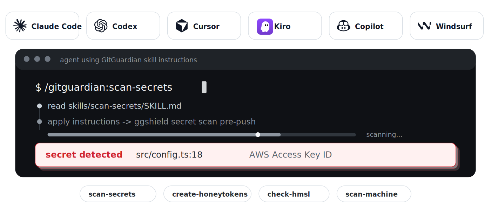

# GitGuardian Agent Skills

Find exposed credentials before attackers abuse them, block new leaks before they ship, and plant honeytokens to detect future misuse. This repo ships skill files that teach AI coding agents how to use GitGuardian through the GitGuardian CLI ([`ggshield`](https://github.com/GitGuardian/ggshield)), the Developer MCP server, and API-backed workflows where appropriate - when to scan, which flags to use, how to interpret findings, how to walk the user through removal and rotation, and when and where to plant honeytokens.

Supported agents: [Claude Code](https://claude.ai/code), [Codex](https://openai.com/codex/), [Cursor](https://cursor.com), [VS Code (GitHub Copilot)](https://code.visualstudio.com/docs/copilot/overview), [Kiro](https://kiro.dev). Install instructions below.

## Skills and Commands

Four skills map to four slash commands:

| Workflow | Command | Skill | Use when | Key rule |
|---|---|---|---|---|
| Find hardcoded secrets in code, commits, history, Docker images, or packages | `/gitguardian:scan-secrets` | [`scan-secrets`](skills/scan-secrets/SKILL.md) | You are handling credentials, editing `.env` or CI files, preparing a commit or push, or auditing a repo for leaked secrets. | Scan first, remediate from structured findings. |
| Generate and place decoy AWS credentials | `/gitguardian:create-honeytokens` | [`create-honeytokens`](skills/create-honeytokens/SKILL.md) | You want decoy credentials in `.env.example`, docs, runbooks, archived repos, or other attractive leak surfaces. | Plant where attackers look, not where engineers import. |
| Audit a whole developer machine for credentials | `/gitguardian:scan-machine` | [`scan-machine`](skills/scan-machine/SKILL.md) | You are wiping, selling, returning, or auditing a developer machine. | Broad endpoint scan; requires workspace endpoint scanning. |
| Check known credentials against public leaks | `/gitguardian:check-hmsl` | [`check-hmsl`](skills/check-hmsl/SKILL.md) | You already have a token, key, `.env`, vault inventory, or inherited credential list and want to know whether any value has appeared in indexed public leaks. | User-run handoff only; never read or run against the credential file. |

Skills also auto-trigger from context. Editing `.env` files, CI configs, credential-handling code, or deployment scripts should activate `scan-secrets`; asking whether a known token has leaked should activate `check-hmsl`.

## Quick Start

<details open>
<summary><strong>Claude Code</strong></summary>

Add this repo as a plugin marketplace, then install the `gitguardian` plugin:

```text
/plugin marketplace add GitGuardian/agent-skills
/plugin install gitguardian
```

Recommended defense in depth after `ggshield` is installed and authenticated:

```bash
ggshield install -t claude-code -m global
```

The hook scans prompts, tool calls, and tool outputs from inside Claude Code. It requires `ggshield` 1.49.0 or later.

</details>

<details>
<summary><strong>Codex</strong></summary>

Add the marketplace, then install `gitguardian` from the plugin browser:

```bash
codex plugin marketplace add GitGuardian/agent-skills
codex
/plugins
```

Requires Codex CLI v0.117.0 or later. Select the GitGuardian marketplace, open `gitguardian`, and choose **Install plugin**.

</details>

<details>
<summary><strong>VS Code with GitHub Copilot</strong></summary>

Open the Command Palette, run **Chat: Install Plugin From Source**, and paste:

```text
https://github.com/GitGuardian/agent-skills
```

Copilot detects the plugin manifest and installs the `gitguardian` plugin.

</details>

<details>
<summary><strong>Cursor and 50+ other agents</strong></summary>

Install with the [skills.sh](https://skills.sh) CLI:

```bash
npx skills add gitguardian/agent-skills
```

This works with Cursor, GitHub Copilot, OpenCode, Cline, Windsurf, Gemini CLI, Kiro CLI, and other supported agents.

</details>

<details>
<summary><strong>Kiro</strong></summary>

1. Open Kiro and go to **Powers -> Add Power**.
2. Choose **Add power from GitHub URL**.
3. Enter:

   ```text
   https://github.com/GitGuardian/agent-skills/tree/main/kiro
   ```

If your Kiro version does not accept a GitHub subdirectory, clone this repo and add the local `kiro/` folder instead.

</details>

## Example Prompts

### Scan For Secrets

```text
Scan this repo for hardcoded credentials
Audit the full git history for leaked secrets
Did I just commit any tokens? Scan the staged changes first
Find the secrets I leaked in commit abc1234
Scan this Docker image for embedded credentials
```

### Plant Honeytokens

```text
Drop a honeytoken in my .env.example before I publish this repo
Generate a decoy AWS credential for my Confluence runbook
Plant a tripwire credential so I know if anyone clones our archived repos
Create a honeytoken for the staging deploy script
```

### Scan A Whole Machine

```text
Audit my whole machine for credentials before I wipe it
Scan my home folder for AWS keys and SSH credentials
What credentials are sitting on this machine?
Check ~/.aws, ~/.kube and my shell history for live tokens
```

### Check Known Credentials With HMSL

```text
I inherited a .env from a former teammate. Check if any of these are compromised
Run an HMSL check on this list of API keys
Show me which of these credentials have appeared in public leaks
```

For HMSL, the agent should not run the check itself. It should hand you a command such as:

```bash
ggshield hmsl check /path/to/secrets.txt --json -n none
```

You run it locally, then paste back only sanitized `--json -n none` output or a human summary.

## How the Skills Work

Every skill is self-contained:

```text
skills/<skill>/
  SKILL.md              # entry point the agent reads first
  references/           # deeper workflow docs loaded only when needed
  evals/                # optional eval prompts and fixtures
```

Design choices:

- **CLI-first scanning.** Secret detection uses `ggshield` because it can scan paths, staged changes, history, commits, Docker images, and packages locally.
- **Progressive disclosure.** `SKILL.md` stays short enough to load quickly; long remediation, setup, and workflow details live in `references/`.
- **Structured remediation.** `scan-secrets` points to the GitGuardian Remediation Doctrine before advising on rotation, false positives, history rewrite, or HMSL follow-up.
- **HMSL handoff.** `check-hmsl` is intentionally user-run only. The agent prepares commands and interprets sanitized output, but it must not read credential files or invoke `ggshield hmsl` on them.
- **Cross-agent packaging.** The same skills ship through Claude Code, Codex, Cursor, VS Code Copilot, skills.sh, and Kiro-specific power files.

## Requirements

- A [GitGuardian account](https://dashboard.gitguardian.com/signup). The free tier is enough for repo scanning and basic setup.
- [`ggshield`](https://github.com/GitGuardian/ggshield) 1.49.0 or later for full hook support.
- Additional workspace capabilities for some flows:
  - Honeytokens require Manager access and a token with `honeytokens:write`.
  - Machine scans require endpoint scanning enabled on the workspace.
  - Authenticated HMSL checks use the user's workspace quota; anonymous checks have lower quota.

## Bundled MCP Server

The plugin includes GitGuardian Developer MCP server configuration for supported hosts:

| Host | Config file |
|---|---|
| Claude Code | [`.mcp.json`](.mcp.json) |
| Codex | [`.codex-mcp.json`](.codex-mcp.json) |
| Cursor | [`mcp.json`](mcp.json) |

The MCP server adds GitGuardian API-backed tools for incident triage and honeytoken management. Secret scanning stays CLI-first through `ggshield`, because the skills need local path, staged-change, history, Docker image, and package scanning. The MCP server requires [`uvx`](https://docs.astral.sh/uv/) on your PATH. For EU SaaS or self-hosted instances, set `GITGUARDIAN_URL` in the MCP server config.

## Project Structure

```text
agent-skills/
|-- .claude-plugin/         # Claude Code plugin manifest and marketplace entry
|-- .cursor-plugin/         # Cursor plugin manifest and marketplace entry
|-- .codex-plugin/          # Codex plugin manifest
|-- .agents/plugins/        # Codex repo-scoped marketplace
|-- skills/                 # self-contained GitGuardian skills
|   |-- scan-secrets/       # secret detection and remediation
|   |-- create-honeytokens/ # honeytoken generation and planting
|   |-- scan-machine/       # endpoint-wide credential inventory
|   `-- check-hmsl/         # user-run public leak checks for known credentials
|-- kiro/                   # Kiro power and steering files
|-- test/                   # install-flow sanity tests
`-- assets/                 # README visual assets
```

## Local Development

Load the repo directly while editing skills:

```bash
claude --plugin-dir /path/to/agent-skills
```

For Codex:

```bash
codex plugin marketplace add file:///path/to/agent-skills
codex
/plugins
```

For Cursor:

```bash
ln -s /path/to/agent-skills ~/.cursor/plugins/local/gitguardian
```

Reload the host after editing `SKILL.md` files. Claude Code can pick up changes with `/reload-plugins`.

## Testing

Install dependencies once:

```bash
npm install
```

Run the install-flow sanity suite:

```bash
npm run test:sanity
```

Other validation used in CI:

```bash
for f in $(find . -name '*.json' -not -path './.git/*' -not -path './node_modules/*'); do jq empty "$f"; done
find skills -mindepth 1 -maxdepth 1 -type d ! -name '*-workspace' -exec skills-ref validate {} \;
ggshield secret scan path -r -y .
```

CI also runs `claude plugin validate .` and a repo-wide `ggshield` scan to catch accidental secrets before merge.

## License

MIT
